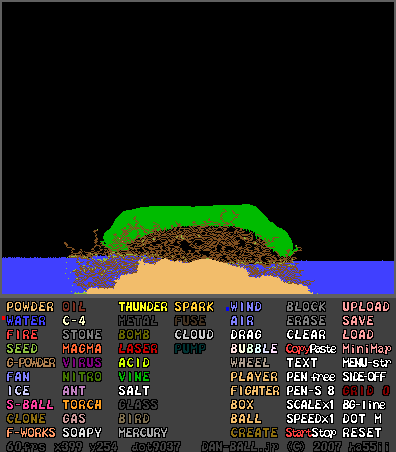
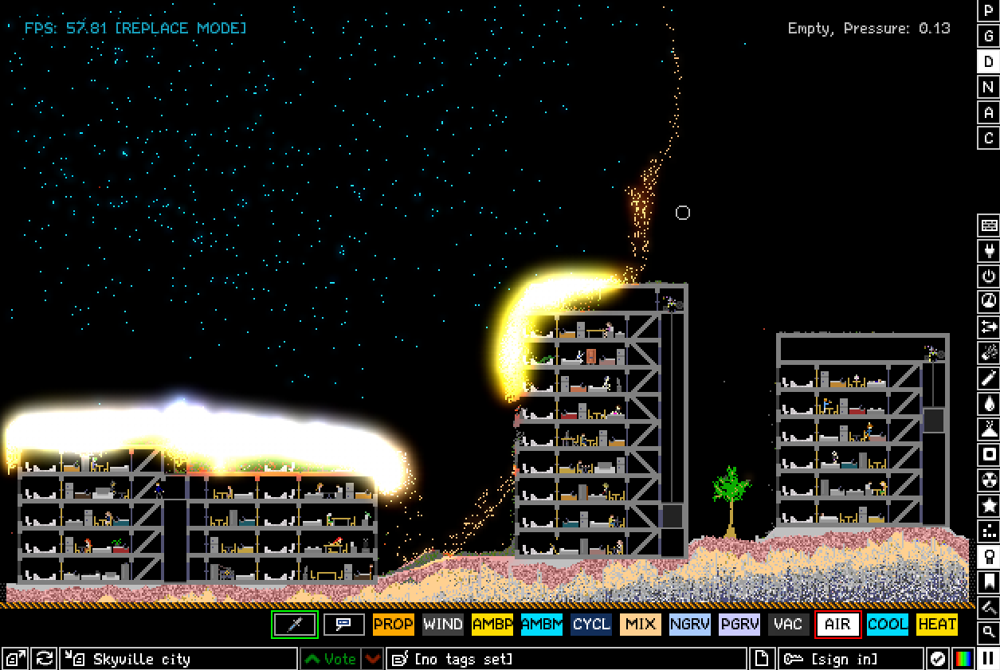

_Pictured above, a screenshot of [Powder Game, by Dan-Ball.](https://dan-ball.jp/en/javagame/dust/)_

Growing up, I've always liked video games that gave total freedom to the player. Being able to experience a virtual world without being constrained by an objective, or artificial boundaries
felt more immersive. You could create your own rules and your own objectives, and depending on how complex the tools you have at your disposal, and how boundless your imagination, were, the game could have a virtually infinite replayability.

I was always looking up online for new Flash games that would give me this experience (learning English in the process), and found out that the "sandbox game" genre had a lot of variety to offer.

I've discovered a lot of games that way : 
- [SoupToys](https://souptoys.en.uptodown.com/windows), which is a virtual toy box directly on the desktop, for Windows.
- [Algodoo (formerly Phun)](http://www.algodoo.com/), a physics-based simulator, featuring fluid dynamics, scripting, and a "workshop" where you can share and download your creations. (I **highly** recommend this one.)  
- [OE Cake](https://www.scuzzstuff.org/oe_cake/), a 2D fluid physics sandbox game, where you can mess around with soft-body and elastic reactions.
- And many more, that I completely forgot the names of. 

But the kind of sandbox games I enjoy the most is :

## Falling-sand games

Falling-sand games are sandbox games that simulates individual particles, and their interaction between each other. You usually have a lot of elements to choose from, each with their unique properties.
For example, water extinguishes fires, becomes steam when heated and ice when cooled, sand that could melt using lava, become glass when cooled, and sinks in water, or nitroglycerin, that would explode in a glorious fireball at the slightest spark.
Users can often share their creations between each others, making platformer levels to use with playable characters, pixel-art, intricate constructions to blow up, electric circuits, and more.

Notable examples of falling-sand games:
- [Powder Game](https://dan-ball.jp/en/javagame/dust/) and [Powder Game 2](https://dan-ball.jp/en/javagame/dust2/) by Dan-Ball. My first real introduction to falling-sand games. It features a lot of elements and mechanics to play around with, as well as a playable character and enemies.
- [The Powder Toy](https://powdertoy.co.uk/), a desktop falling-sand game made in C++. It has beautiful visuals, with glowing effects, an impressive variety of elements, a Game of Life simulation, nuclear reactions, electronics, mods, and much more! I would consider this to be the most advanced falling-sand game available today. 
- [Sandspiel](https://sandspiel.club/), a very charming, relaxing falling-sand game made by [Max Bittker](https://maxbittker.com/). I'm particularly fond of his flower generation. I highly recommend checking his others projects like [Orb.farm](https://orb.farm/), and his blog, where he also talks about falling-sand games and the story behind Sandspiel.
- [tree-game](https://github.com/segfaultdev/tree), which is a more nature-oriented version, a "garden simulator".

## Sandfall

[Sandfall](https://rodriguegaspard.github.io/sandfall) is a falling-sand game I'm working on. it will be made in Rust and playable in the browser. I will try to expand on the stuff I like the most about falling-sand games, while making it a bit more realistic. I would like to feature soft-body and rigid body physics, simple ray-casting for light, and multiple types of NPC's and enemies to play around with.

It's pretty much in its infancy, but I'm hoping to have a simple version up and running on this website soon. Of course, it will be open-source and anyone is free to participate in its development. 
