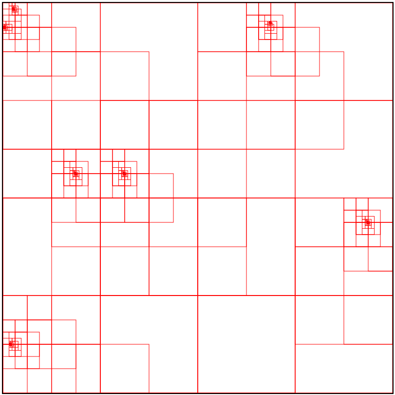

I've worked a little bit more on sandfall, now I can display my quadtree state and individual particles on a HTML canvas element. Being able to visualize my project really put some wind in my sails and motivate me to work on it more! Stay tuned for more updates.

_Pictured above, what I can currently visualize. I've added particles at random locations._
